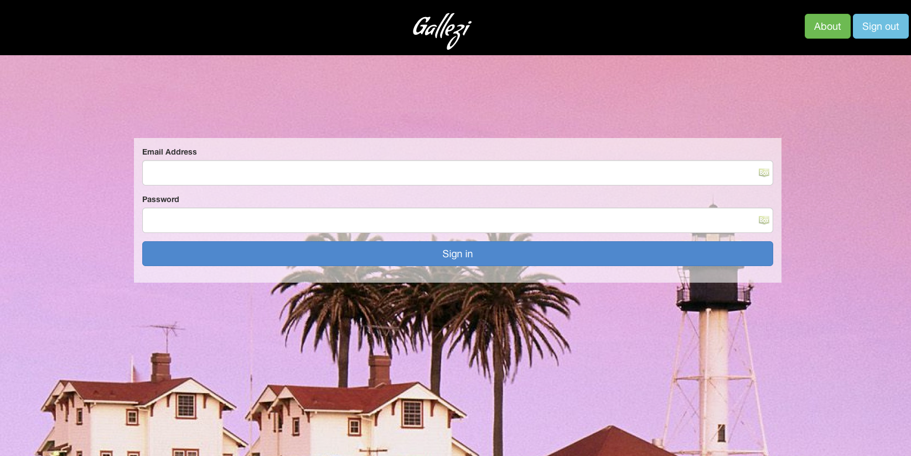
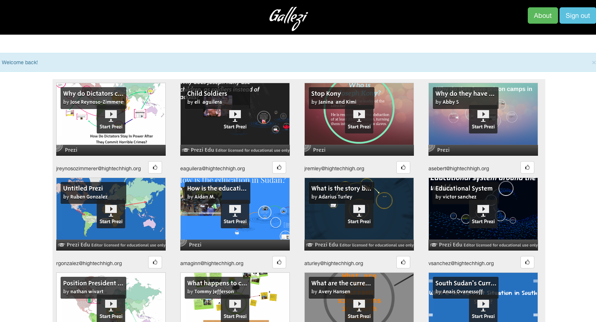
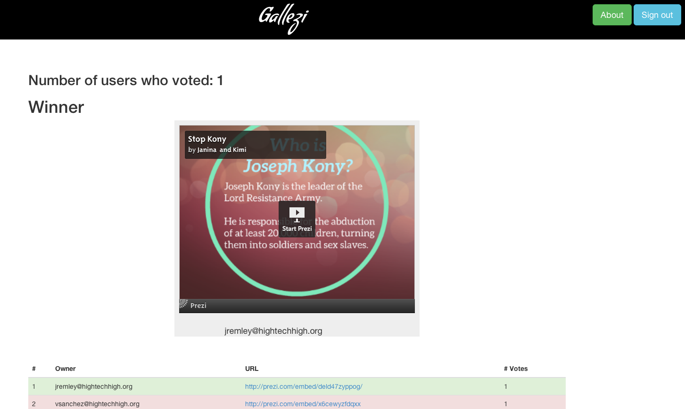

gallezi
=======

Prezi gallery with vote interface.

####Libraries used:####

#####1.Backend#####

     - flask
     - flask-admin
     - flask-login
     - sqlalchemy

#####2. Front-end#####

     - bootstrap 3.0
     - font-awesome
     - masonry
     - jquery

### What it is? ###
I got the idea when I saw this school next to San Diego, preparing an exhibition, for a fundraising campaign. They wanted to use Prezi to showcase their projects. Being able to vote for the best presentation, and reward the students having created it was needed.
I decide to create a small web app, easily reusable, to help people wanting to do the same.
It might not fit for all needs, but it is a good base for a showcase/vote app for Prezis.
It is also easy to extend for any kind of presentation, embeddable.

### Screenshots ###

